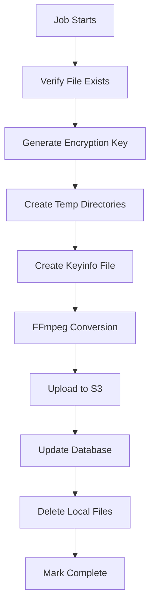
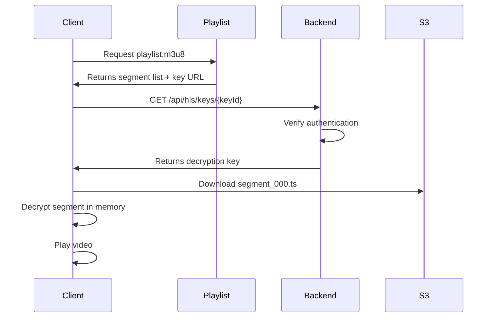

# 🎥 Video Upload & HLS Conversion Workflow

> **System Documentation for Secure Video Delivery with HLS Encryption**

---

## 📋 Table of Contents

- Overview
- Architecture
- Creating a Lesson with Videos
- Editing a Lesson (Replace/Swap Videos)
- Deleting a Lesson
- HLS Conversion Job Details
- File Storage Locations
- Security Features
- Error Handling & Troubleshooting
- Configuration
- Performance & Optimization
- Future Improvements

---

# 🌟 Overview

The system implements a **secure video delivery system** using **HLS (HTTP Live Streaming)** with **AES-128 encryption**. Videos uploaded by admins are automatically converted to encrypted HLS format and stored in AWS S3. 

## 🔑 Key Innovation
**Original MP4 files are NEVER stored in the cloud** - ensuring better security and reduced storage costs.

### ✨ Key Features

- ✅ **No S3 Round-Trip** - Videos processed locally before cloud upload
- ✅ **HLS Encryption** - AES-128 encryption for video segments
- ✅ **Automatic Cleanup** - Old HLS files deleted when replaced
- ✅ **Multiple Videos** - Support for multiple videos per lesson
- ✅ **Background Processing** - Queue jobs for video conversion
- ✅ **Bandwidth Optimization** - Only encrypted segments uploaded to S3

---

# 🏗️ Architecture

## System Flow Diagram

```
┌─────────────────────────────────────────────────────────┐
│                     ADMIN PANEL                         │
│                    (Filament UI)                        │
└───────────────────────┬─────────────────────────────────┘
                        │ Upload MP4
                        ▼
┌─────────────────────────────────────────────────────────┐
│              Livewire Temporary Storage                 │
│         storage/app/private/livewire-tmp/               │
└───────────────────────┬─────────────────────────────────┘
                        │ Filament saves
                        ▼
┌─────────────────────────────────────────────────────────┐
│                Local Disk Storage                       │
│         storage/app/lesson-videos-temp/                 │
└───────────────────────┬─────────────────────────────────┘
                        │ afterCreate/afterSave
                        ▼
┌─────────────────────────────────────────────────────────┐
│          Permanent Temp for Job Processing              │
│          storage/app/video-processing/                  │
│     lesson_13_video_0_abc123_filename.mp4               │
└───────────────────────┬─────────────────────────────────┘
                        │ Queue Job Dispatched
                        ▼
┌─────────────────────────────────────────────────────────┐
│              ConvertVideoToHLS Job                      │
│    1. Generate encryption key (AES-128)                 │
│    2. FFmpeg: MP4 → HLS segments                        │
│    3. Upload to S3: hls/{lessonId}/{videoIndex}/        │
│    4. Delete local temp file                            │
└───────────────────────┬─────────────────────────────────┘
                        │ Upload encrypted segments
                        ▼
┌─────────────────────────────────────────────────────────┐
│                   AWS S3 BUCKET                         │
│              my-course-app-videos                       │
│                                                          │
│  hls/                                                   │
│    └── 13/              (Lesson ID)                     │
│        ├── 0/           (Video Index 0)                 │
│        │   ├── playlist.m3u8                            │
│        │   ├── segment_000.ts                           │
│        │   ├── segment_001.ts                           │
│        │   └── ...                                      │
│        └── 1/           (Video Index 1)                 │
│            └── ...                                      │
│                                                          │
│  video-thumbnails/                                      │
│  lesson-thumbnails/                                     │
└─────────────────────────────────────────────────────────┘
```

---

# 📹 Workflow: Creating a Lesson with Videos

## Step 1: Admin Uploads Video

**Location:** `Filament Admin Panel → Lessons → Create`

### Form Configuration

**File:** `app/Filament/Resources/Lessons/Schemas/LessonForm.php`

```php
FileUpload::make('url')
    ->label('video')
    ->maxSize(512000)  // 500MB max
    ->disk('local')    // ⚠️ Store locally, NOT S3
    ->directory('lesson-videos-temp')
    ->acceptedFileTypes([
        'video/mp4', 
        'video/mov', 
        'video/avi',
        'video/wmv'
    ])
```

### 📂 Result
File saved to: `storage/app/lesson-videos-temp/xyz.mp4`

---

## Step 2: Form Submission

**Trigger:** Admin clicks **"Create"** button

**File:** `app/Filament/Resources/Lessons/Pages/CreateLesson.php`

### Process Flow

```php
protected function afterCreate(): void
{
    foreach ($this->record->video as $index => $video) {
        
        // 1️⃣ Get Livewire temp file path
        $localPath = Storage::disk('local')->path($video['url']);
        
        // 2️⃣ Copy to PERMANENT temp location
        $permanentTempPath = storage_path(
            "app/video-processing/lesson_{$lessonId}_video_{$index}_" 
            . uniqid() . "_" . basename($localPath)
        );
        copy($localPath, $permanentTempPath);
        
        // 3️⃣ Dispatch background job
        ConvertVideoToHLS::dispatch(
            $lessonId, 
            $permanentTempPath,
            $index,
            basename($localPath)
        );
    }
    
    // 4️⃣ Mark as processing
    $lesson->update(['hls_processing' => true]);
}
```

### 💡 Why Copy to Permanent Temp?

| Issue | Solution |
|-------|----------|
| Livewire may auto-clean temp files | Copy to permanent location |
| Race conditions if admin edits again | Unique filename prevents conflicts |
| Queue worker might be slow | File persists until job completes |

---

## Step 3: Background Job Processing

**Job:** `app/Jobs/ConvertVideoToHLS.php`

### ⚙️ Queue Configuration

- **Driver:** Database (`config/queue.php`)
- **Timeout:** 3600 seconds (1 hour)
- **Worker:** `php artisan queue:work`

### 🔄 Job Processing Flow



### 📝 Detailed Steps

**1. Verify Local File**
```php
if (!file_exists($this->localVideoPath)) {
    throw new Exception("File not found");
}
```

**2. Generate Encryption Components**
```php
$encryptionKey = random_bytes(16);        // AES-128 key (128 bits)
$keyId = Str::ulid()->toString();         // Unique key ID
$iv = bin2hex(random_bytes(16));          // Initialization vector
```

**3. Create Temp Directories**
```php
$tempDir = storage_path("app/temp/{$lessonId}_{$videoIndex}/");
$hlsOutputDir = storage_path("app/hls/{$lessonId}_{$videoIndex}/");
```

**4. Create Keyinfo File**
```php
file_put_contents($keyInfoPath, implode("\n", [
    url("/api/hls/keys/{$keyId}"),  // Key URL (for player)
    $keyPath,                        // Local key file path
    $iv                              // Initialization vector
]));
```

**5. FFmpeg Conversion**
```bash
ffmpeg -i input.mp4 \
  -c:v libx264 \
  -c:a aac \
  -hls_time 10 \
  -hls_key_info_file keyinfo.txt \
  -hls_playlist_type vod \
  -hls_segment_filename segment_%03d.ts \
  playlist.m3u8
```

**6. Upload to S3**
```php
foreach ($files as $file) {
    $s3Path = "hls/{$lessonId}/{$videoIndex}/{$filename}";
    Storage::disk('s3')->put($s3Path, file_get_contents($file), 'public');
}
```

**7. Update Database**
```php
$videoData[$videoIndex]['hls_playlist'] = $playlistPath;
$videoData[$videoIndex]['encryption_key_id'] = $keyId;
$videoData[$videoIndex]['encryption_key'] = Crypt::encrypt($encryptionKey);
$videoData[$videoIndex]['original_filename'] = $originalFilename;
unset($videoData[$videoIndex]['url']); // ⚠️ Remove local path
```

**8. Cleanup**
```php
unlink($this->localVideoPath);          // Delete permanent temp
$this->cleanup($tempDir, $hlsOutputDir); // Delete processing dirs
```

---

## Step 4: FFmpeg Conversion Details

### 🎬 FFmpeg Parameters Explained

| Parameter | Value | Purpose |
|-----------|-------|---------|
| `-c:v` | `libx264` | H.264 video codec (widely supported) |
| `-c:a` | `aac` | AAC audio codec |
| `-hls_time` | `10` | 10-second segments |
| `-hls_key_info_file` | `keyinfo.txt` | Encryption configuration |
| `-hls_playlist_type` | `vod` | Video on demand (not live stream) |
| `-hls_segment_filename` | `segment_%03d.ts` | Naming pattern for segments |

### 📤 Output Structure

```
storage/app/hls/13_0/
├── playlist.m3u8      ← Master playlist
├── segment_000.ts     ← 10-second encrypted segment
├── segment_001.ts
├── segment_002.ts
└── ...
```

---

## Step 5: S3 Upload & Storage

### 🌐 S3 Bucket Structure

```
my-course-app-videos/
├── hls/
│   └── 13/                    ← Lesson ID
│       ├── 0/                 ← Video Index 0
│       │   ├── playlist.m3u8
│       │   ├── segment_000.ts (encrypted)
│       │   ├── segment_001.ts (encrypted)
│       │   └── ...
│       └── 1/                 ← Video Index 1
│           └── ...
├── video-thumbnails/          ← Lesson thumbnails
└── lesson-thumbnails/         ← Video thumbnails
```

### ⚠️ What's NOT in S3

- ❌ **Original MP4 files** (never uploaded!)
- ❌ **Encryption keys** (stored encrypted in database, served via API)
- ❌ **Temporary files** (deleted after processing)

---

# ✏️ Workflow: Editing a Lesson

## Scenario 1: Replace Video

**Example:** Replace video #1 with a new upload

### 🔄 Process Flow

**File:** `app/Filament/Resources/Lessons/Pages/EditLesson.php`

```php
// STEP 1: Store original data before editing
protected function mutateFormDataBeforeFill(array $data): array
{
    $this->originalVideos = $data['video'] ?? [];
    return $data;
}

// STEP 2: After save, detect changes
protected function afterSave(): void
{
    foreach ($this->record->video as $index => $video) {
        
        // Check if NEW upload (local path, not HLS path)
        $isLocalPath = !str_starts_with($video['url'], 'hls/');
        
        if ($isLocalPath) {
            
            // 1️⃣ DELETE OLD HLS FILES
            $oldHlsDir = "hls/{$lessonId}/{$index}/";
            $hlsFiles = Storage::disk('s3')->allFiles($oldHlsDir);
            
            if (!empty($hlsFiles)) {
                Storage::disk('s3')->deleteDirectory($oldHlsDir);
                Log::info("Deleted {$oldHlsDir}");
            }
            
            // 2️⃣ Delete old thumbnail (if changed)
            if (isset($this->originalVideos[$index]['thumbnail'])) {
                Storage::disk('s3')->delete($this->originalVideos[$index]['thumbnail']);
            }
            
            // 3️⃣ Copy to permanent temp
            $permanentTempPath = storage_path("app/video-processing/...");
            copy($localPath, $permanentTempPath);
            
            // 4️⃣ Dispatch new conversion job
            ConvertVideoToHLS::dispatch($lessonId, $permanentTempPath, $index, ...);
        }
    }
}
```

### 🗑️ What Gets Deleted?

- ✅ Old HLS directory: `hls/13/0/` (playlist + all segments)
- ✅ Old thumbnail (if changed)
- ❌ No original MP4 to delete (never uploaded!)

---

## Scenario 2: Swap/Reorder Videos

**Example:** Swap video positions in the repeater

### Before Swap
- **Video 0:** `big.mp4` → 43 HLS segments
- **Video 1:** `small.mp4` → 1 HLS segment

### After Swap
- **Video 0:** `small.mp4` (new upload)
- **Video 1:** `big.mp4` (new upload)

### ⚡ What Happens

1. Admin uploads new files at **both** positions
2. `afterSave()` detects local paths at index **0** and **1**
3. **Deletes** `hls/13/0/` (old 43 segments) ✅
4. **Deletes** `hls/13/1/` (old 1 segment) ✅
5. Converts new files and uploads to same paths
6. **No orphaned files!** 🎉

---

## Scenario 3: Remove Video from Repeater

**Example:** Delete video #2 from a lesson

```php
// Detect removed videos
foreach ($this->originalVideos as $index => $oldVideo) {
    $stillExists = isset($this->record->video[$index]);
    
    if (!$stillExists) {
        // Video was removed from repeater
        
        // Delete HLS directory
        Storage::disk('s3')->deleteDirectory("hls/{$lessonId}/{$index}/");
        
        // Delete thumbnail
        if (isset($oldVideo['thumbnail'])) {
            Storage::disk('s3')->delete($oldVideo['thumbnail']);
        }
        
        Log::info("Removed video at index {$index}");
    }
}
```

---

# 🗑️ Workflow: Deleting a Lesson

**Trigger:** Admin clicks **"Delete"** on a lesson

**File:** `app/Models/Lesson.php`

### 🧹 Automatic Cleanup

```php
protected static function booted(): void
{
    static::deleting(function ($lesson) {
        
        // 1️⃣ Delete ALL HLS directories
        if (is_array($lesson->video)) {
            foreach ($lesson->video as $index => $video) {
                $hlsDir = "hls/{$lesson->id}/{$index}/";
                Storage::disk('s3')->deleteDirectory($hlsDir);
            }
        }
        
        // 2️⃣ Delete lesson thumbnail
        if ($lesson->thumbnail) {
            Storage::disk('s3')->delete($lesson->thumbnail);
        }
        
        // 3️⃣ Delete video thumbnails
        foreach ($lesson->video as $video) {
            if (isset($video['thumbnail'])) {
                Storage::disk('s3')->delete($video['thumbnail']);
            }
        }
    });
}
```

### 📊 Result
All S3 files for the lesson are automatically deleted! No orphaned files.

---

# ⚙️ HLS Conversion Job Details

## 📋 Job Properties

```php
class ConvertVideoToHLS implements ShouldQueue
{
    public $timeout = 3600;  // 1 hour maximum
    
    protected int $lessonId;
    protected string $localVideoPath;  // Permanent temp path
    protected int $videoIndex;
    protected ?string $originalFilename;
}
```

## 🔄 Processing Pipeline

### 1. Validate Input
- ✅ Check if local file exists
- ✅ Verify lesson exists in database

### 2. Generate Encryption
- 🔑 16-byte AES-128 key
- 🆔 Unique key ID (ULID)
- 🔀 Random initialization vector

### 3. FFmpeg Conversion
- 📥 Input: Local MP4 file
- 📤 Output: HLS segments (10 seconds each)
- 🔒 Encryption: AES-128 per segment

### 4. S3 Upload
- ☁️ Upload all `.ts` segments
- 📄 Upload `playlist.m3u8`
- 🌐 Set visibility: `public`

### 5. Database Update
- 💾 Store HLS playlist path
- 🔐 Store encrypted encryption key
- 🆔 Store key ID
- 🗑️ Remove `url` field (local path)

### 6. Cleanup
- 🧹 Delete permanent temp file
- 🧹 Delete processing directories
- 🧹 Remove temp encryption files

---

## ⚠️ Error Handling

```php
catch (\Exception $e) {
    Log::error("HLS conversion failed", [
        'lesson_id' => $lessonId,
        'error' => $e->getMessage(),
        'trace' => $e->getTraceAsString()
    ]);
    
    $lesson->update(['hls_processing' => false]);
    
    throw $e;  // Queue will retry automatically
}
```

### 🚨 Known Issue
If job fails, temp file remains in `video-processing/` directory.

**Solution:** Needs manual cleanup or scheduled task.

---

# 📂 File Storage Locations

## 💻 Local Storage (Temporary)

| Location | Purpose | Cleaned By |
|----------|---------|------------|
| `storage/app/private/livewire-tmp/` | Livewire uploads | Livewire auto-cleanup |
| `storage/app/lesson-videos-temp/` | Filament temporary storage | Manual/Livewire |
| `storage/app/video-processing/` | Job processing (permanent temp) | Job after success ✅ |
| `storage/app/temp/{lessonId}_{index}/` | Encryption keys | Job after upload ✅ |
| `storage/app/hls/{lessonId}_{index}/` | HLS output before S3 | Job after upload ✅ |

## ☁️ AWS S3 (Permanent)

| Location | Content | Visibility |
|----------|---------|------------|
| `hls/{lessonId}/{videoIndex}/` | HLS segments + playlist | Public |
| `video-thumbnails/` | Lesson thumbnails | Public |
| `lesson-thumbnails/` | Video thumbnails | Public |

### ❌ NOT Stored in S3
- Original MP4 files
- Encryption keys (served via API)
- Temporary processing files

---

# 🔐 Security Features

## 1. HLS Encryption (AES-128)

### 🎯 Why Encrypt?
- 🚫 Prevents video download/piracy
- 🔒 Forces playback through app
- 🎬 Each segment individually encrypted

### 🔑 How It Works



### 📝 Example Playlist

```m3u8
#EXTM3U
#EXT-X-VERSION:3
#EXT-X-TARGETDURATION:10
#EXT-X-MEDIA-SEQUENCE:0
#EXT-X-KEY:METHOD=AES-128,URI="https://yourdomain.com/api/hls/keys/01JBKH..."
#EXTINF:10.0,
segment_000.ts
#EXTINF:10.0,
segment_001.ts
```

---

## 2. Original MP4 Never Stored

### ✅ Benefits

- 🔐 Better security (no raw video download possible)
- 💰 Reduces storage costs
- 🚀 Faster S3 operations
- 🎯 Forces encrypted delivery

---

## 3. Encryption Key Storage

### 💾 Database Storage

```php
// Keys stored ENCRYPTED in database
$videoData[$index]['encryption_key'] = Crypt::encrypt($encryptionKey);
```

### 🔓 Key Delivery API

```php
Route::middleware('auth:sanctum')
    ->get('/api/hls/keys/{keyId}', function ($keyId) {
    
    // 1. Find video with this key ID
    $lesson = Lesson::whereRaw(
        "JSON_CONTAINS(video, JSON_OBJECT('encryption_key_id', ?))", 
        [$keyId]
    )->first();
    
    if (!$lesson) abort(404);
    
    // 2. Decrypt and return key
    foreach ($lesson->video as $video) {
        if ($video['encryption_key_id'] === $keyId) {
            $key = Crypt::decrypt($video['encryption_key']);
            
            return response($key, 200, [
                'Content-Type' => 'application/octet-stream'
            ]);
        }
    }
    
    abort(404);
});
```

### 🔒 Access Control

- ✅ HLS playlists are public (required for video players)
- ✅ Encryption prevents unauthorized viewing
- ✅ Key API endpoint requires authentication
- ✅ Keys served only to authenticated users

---

# 🚨 Error Handling & Troubleshooting

## Common Issues

| Issue | Cause | Solution |
|-------|-------|----------|
| "Local video file not found" | Livewire cleaned temp file | ✅ Now using permanent temp copy |
| FFmpeg timeout | Video too large | Increase `timeout` in job |
| S3 upload fails | Network/credentials issue | Job will retry automatically |
| Job fails repeatedly | Invalid video format | Check FFmpeg error logs |
| Videos stuck "processing" | Queue worker not running | Run `php artisan queue:work` |

---

## 🔍 Debugging Commands

### Check Failed Jobs
```bash
php artisan queue:failed
```

### Retry Failed Job
```bash
php artisan queue:retry {id}
```

### Retry All Failed Jobs
```bash
php artisan queue:retry all
```

### Clear All Failed Jobs
```bash
php artisan queue:flush
```

### Monitor Queue in Real-Time
```bash
php artisan queue:work --verbose
```

---

## 📊 Check Logs

### Laravel Log
```bash
tail -f storage/logs/laravel.log
```

### Filter for HLS Operations
```bash
tail -f storage/logs/laravel.log | grep "HLS"
```

---

## 🛠️ FFmpeg Debugging

### Check FFmpeg Installation
```bash
ffmpeg -version
```

### Test FFmpeg Manually
```bash
ffmpeg -i input.mp4 \
  -c:v libx264 \
  -c:a aac \
  -hls_time 10 \
  -hls_playlist_type vod \
  output.m3u8
```

---

# ⚙️ Configuration

## 🐘 PHP Settings

**File:** `C:\xampp\php\php.ini`

```ini
upload_max_filesize = 1024M
post_max_size = 1000M
max_execution_time = 600
max_input_time = 600
memory_limit = 512M
```

> ⚠️ **Remember:** Restart Apache after changing `php.ini`

---

## ⚡ Livewire Configuration

**File:** `config/livewire.php`

```php
'temporary_file_upload' => [
    'disk' => 'local',              // ⚠️ NOT 's3'!
    'rules' => ['file', 'max:512000'], // 500MB
    'max_upload_time' => 30,        // 30 minutes
],
```

---

## 🔄 Queue Configuration

**File:** `config/queue.php`

```php
'default' => 'database',

'connections' => [
    'database' => [
        'driver' => 'database',
        'table' => 'jobs',
        'queue' => 'default',
        'retry_after' => 3600,  // 1 hour
    ],
],
```

---

## ☁️ S3 Configuration

**File:** `config/filesystems.php`

```php
's3' => [
    'driver' => 's3',
    'key' => env('AWS_ACCESS_KEY_ID'),
    'secret' => env('AWS_SECRET_ACCESS_KEY'),
    'region' => env('AWS_DEFAULT_REGION', 'eu-north-1'),
    'bucket' => env('AWS_BUCKET', 'my-course-app-videos'),
    'url' => env('AWS_URL'),
    'visibility' => 'public',
],
```

---

## 🔐 Environment Variables

**File:** `.env`

```env
QUEUE_CONNECTION=database

AWS_ACCESS_KEY_ID=your-access-key-here
AWS_SECRET_ACCESS_KEY=your-secret-key-here
AWS_DEFAULT_REGION=eu-north-1
AWS_BUCKET=my-course-app-videos
```

---

# 📈 Performance & Optimization

## ⏱️ Processing Time Estimates

| File Size | Upload | FFmpeg | S3 Upload | **Total** |
|-----------|--------|--------|-----------|-----------|
| 10 MB | ~5s | ~15s | ~5s | **~25s** |
| 50 MB | ~15s | ~45s | ~20s | **~80s** |
| 100 MB | ~30s | ~90s | ~40s | **~160s** |
| 500 MB | ~120s | ~450s | ~180s | **~750s** |

> **Note:** Times vary based on network speed, CPU, video codec, and resolution.

---

## 🚀 Bandwidth Savings

### Old Workflow (Inefficient)
```
Upload 100MB to S3
    ↓
Download 100MB from S3
    ↓
Convert to HLS
    ↓
Upload 100MB HLS to S3

Total: 300MB network I/O
```

### New Workflow (Optimized)
```
Upload to local storage
    ↓
Convert locally
    ↓
Upload 100MB HLS to S3

Total: 100MB network I/O
```

### 📊 Result
**~66% reduction in network I/O!** 🎉

---

## 💰 Cost Optimization

### S3 Request Pricing (Example)
- PUT requests: $0.005 per 1,000 requests
- GET requests: $0.0004 per 1,000 requests

### Savings Per Video (100MB)

| Operation | Old Workflow | New Workflow | Savings |
|-----------|-------------|--------------|---------|
| PUT (upload) | 2 requests | 1 request | 50% |
| GET (download) | 1 request | 0 requests | 100% |
| Storage | 200MB (MP4+HLS) | 100MB (HLS only) | 50% |

---

# 🧹 Maintenance Tasks

## 📅 Recommended Scheduled Tasks

### 1. Daily: Clean Old Livewire Temp Files

**File:** `app/Console/Kernel.php`

```php
protected function schedule(Schedule $schedule)
{
    // Clean files older than 1 day
    $schedule->call(function () {
        $files = Storage::disk('local')->files('lesson-videos-temp');
        
        foreach ($files as $file) {
            $lastModified = Storage::disk('local')->lastModified($file);
            
            if ($lastModified < now()->subDay()->timestamp) {
                Storage::disk('local')->delete($file);
                Log::info("Cleaned old temp file: {$file}");
            }
        }
    })->daily()->at('02:00');
}
```

---

### 2. Weekly: Clean Failed Job Temp Files

```php
// Clean failed job files older than 1 week
$schedule->call(function () {
    $files = glob(storage_path('app/video-processing/*'));
    
    foreach ($files as $file) {
        if (is_file($file) && filemtime($file) < strtotime('-1 week')) {
            unlink($file);
            Log::info("Cleaned failed job temp file: {$file}");
        }
    }
})->weekly()->sundays()->at('03:00');
```

---

### 3. Monthly: S3 Storage Audit

```bash
# Check S3 storage usage
aws s3 ls s3://my-course-app-videos/hls/ --recursive --summarize

# Find large lessons
aws s3 ls s3://my-course-app-videos/hls/ --recursive --human-readable | sort -k3 -hr | head -20
```

---

# 🔮 Future Improvements

## 🎯 Potential Enhancements

### 1. Adaptive Bitrate Streaming (ABR)
- Generate multiple quality levels (360p, 720p, 1080p)
- Client auto-switches based on bandwidth
- Better user experience

### 2. Real-Time Progress Tracking
- Show FFmpeg conversion progress in admin panel
- Use WebSockets/Pusher for live updates
- Display: "Converting... 45% complete"

### 3. Automatic Thumbnail Generation
- Extract first frame as preview
- Generate thumbnail from video
- Save admin time

### 4. CDN Integration
- CloudFront in front of S3
- Faster global delivery
- Reduced S3 bandwidth costs
- Edge caching

### 5. Video Compression Optimization
- Optimize FFmpeg encoding settings
- Reduce file sizes without quality loss
- Experiment with different codecs (H.265/HEVC)

### 6. Intelligent Cleanup
- Scheduled job to auto-clean temp files
- Monitor disk usage
- Alert when storage threshold reached

### 7. Retry Logic Enhancement
- Exponential backoff for failed jobs
- Separate queue for large files
- Priority queue for small files

### 8. Analytics Integration
- Track video views
- Monitor bandwidth usage
- Popular content insights

---

# 📊 Summary

This implementation provides a **secure, efficient, and cost-effective** video delivery system.

## ✅ Key Achievements

| Feature | Benefit |
|---------|---------|
| 🚀 No wasted bandwidth | Videos processed locally |
| 🔐 Encrypted HLS | Prevents piracy |
| 🧹 Automatic cleanup | No orphaned files |
| ⚡ Scalable | Queue-based background processing |
| 📹 Multiple videos | Support for lessons with many videos |
| ✏️ Smart editing | Handles replacement and reordering |
| 💰 Cost-effective | ~66% reduction in S3 operations |
| 🔒 Secure | Original MP4s never in cloud |

---

## 🎓 The Workflow Ensures

1. **Original high-quality MP4 files never touch the cloud**
2. **Only encrypted HLS segments stored in S3**
3. **Automatic cleanup prevents wasted storage**
4. **Background processing doesn't block admin operations**
5. **Smart detection handles video swapping/reordering**

---

## 🛡️ Security & Privacy

- ✅ AES-128 encryption for all video segments
- ✅ Keys stored encrypted in database
- ✅ Key delivery requires authentication
- ✅ Original files never exposed
- ✅ Playback forced through authorized app

---

> **Last Updated:** November 15, 2025
> 
> **System Version:** Laravel 12.28.1, Filament v4.0, FFmpeg 8.0
